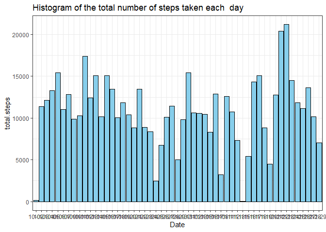
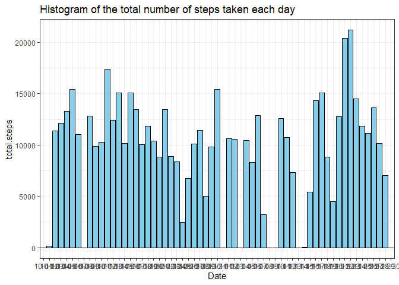
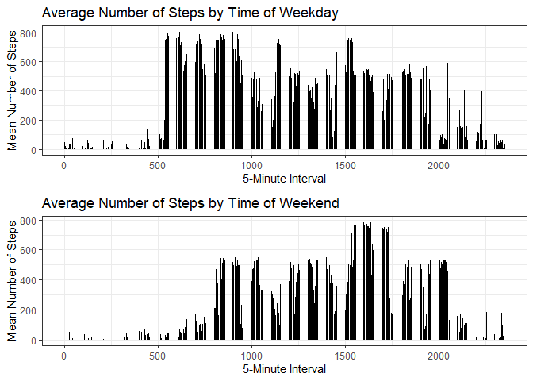

```r
## Loading and preprocessing the data

    rd<-read.csv(file.choose())
    
   
    pd<-  rd[!is.na(rd$steps),]

## What is mean total number of steps taken per day?

    library(dplyr)
```

```
## 
## Attaching package: 'dplyr'
```

```
## The following objects are masked from 'package:stats':
## 
##     filter, lag
```

```
## The following objects are masked from 'package:base':
## 
##     intersect, setdiff, setequal, union
```

```r
    tns<- pd %>% group_by(date)%>% summarize(t.steps=sum(steps))
    tns$short_date <- format(as.Date(tns$date), "%m-%d")
                        
    library(ggplot2)
    
    ggplot(data = tns,aes(x = short_date,y=t.steps))+
                        geom_histogram(stat= "identity",fill="skyblue",color="black" )+
                        labs(title = "Histogram of the total number of steps taken each  day",x="Date",y="total.steps")+
                        theme_bw()
```

<!-- -->

```r
    mns<- pd %>% group_by(date)%>% summarize(mean.steps=mean(steps),median.steps=median(steps))

## What is the average daily activity pattern?

      as <- pd %>%
             group_by( interval) %>%
             summarize(mean.steps = mean(steps),na.rm=TRUE)
         
         plot(x = as$interval, y = as$mean.steps, type = "l", xlab = "5-minute interval", ylab = "Average number of steps")
```

<!-- -->

```r
         max_index <- which.max(as$mean.steps)
         print(as[max_index,])
```

```
## # A tibble: 1 × 3
##   interval mean.steps na.rm
##      <int>      <dbl> <lgl>
## 1      835       206. TRUE
```

```r
## Imputing missing values

 total_missing <- sum(is.na(rd))
         
         ns<-rd
         for (i in 1 : nrow(rd)) {if (is.na(rd$steps[i])){ns$steps[i]<-mns[mns$date==ns$date[i],"mean.steps"]}}
         ns$steps<-as.numeric(ns$steps)
         nsms<- ns %>% group_by(date) %>% summarise(total.steps=sum(steps,na.rm=TRUE),mean.steps=mean(steps,na.rm=TRUE),median.steps=median(steps,na.rm=TRUE)) 
         nsms$short_date <- format(as.Date(nsms$date), "%m-%d")
         ggplot(data = nsms,aes(x = short_date,y=total.steps))+
             geom_histogram(stat= "identity",fill="skyblue",color="black" )+
             labs(title = "Histogram of the total number of steps taken each day",x="Date",y="total.steps")+
             theme_bw()
```

<!-- -->

```r
## Are there differences in activity patterns between weekdays and weekends?
     
     library(gridExtra)
```

```
## 
## Attaching package: 'gridExtra'
```

```
## The following object is masked from 'package:dplyr':
## 
##     combine
```

```r
                ds<-rd
         ds$date<-as.Date(ds$date)
         
         ds$day<-ifelse(weekdays(ds$date) %in% c("Saturday", "Sunday"),"weekend","weekday")
         
         Ds<-ds %>% group_by(interval,day,steps)%>% summarise(mean.steps=mean(steps,na.rm=TRUE))
```

```
## `summarise()` has grouped output by 'interval', 'day'. You can override using
## the `.groups` argument.
```

```r
         Ds_weekday<-Ds[Ds$day =="weekday",]
        p1<- ggplot(data = Ds_weekday,aes(x = interval,y=mean.steps))+
             geom_line()+
             labs(title = "Average Number of Steps by Time of Weekday",
                  x = "5-Minute Interval",
                  y = "Mean Number of Steps") +
             theme_bw()
         Ds_weekend<-Ds[Ds$day =="weekend",]
        p2<- ggplot(data = Ds_weekend,aes(x = interval,y=mean.steps))+
             geom_line()+
             labs(title = "Average Number of Steps by Time of Weekend",
                  x = "5-Minute Interval",
                  y = "Mean Number of Steps") +
             theme_bw()
        grid.arrange(p1, p2, ncol = 1)
```

<!-- -->
